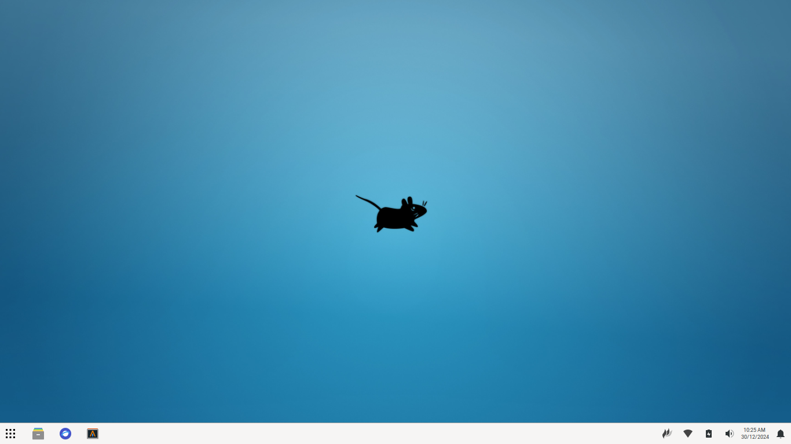
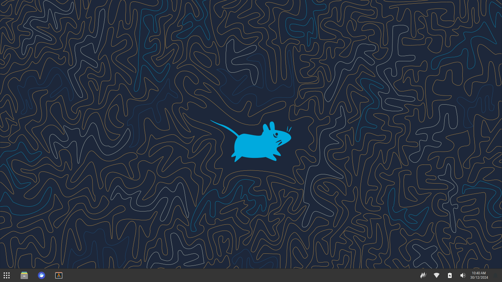

# simple-xfce4-dotfiles

Xfce desktop customization

This is fork of [these liconaj dotfiles](https://github.com/liconaj/xfce4-dotfiles) most of things are made by him but im going to do some modifications to it

## Overview

### Light theme with windows icon

### Dark theme with grid icon

## Known Issues

- settheme seems to be broken, if you want dark theme please change "THEME=light" to "THEME=dark" in setup.sh and then set dark theme in xfce settings.

## Dependencies

### Panel plugins
- xfce4-whiskermenu
- xfce4-docklike-plugin
- power-manager-plugin
- pulseaudio

### Fonts
- Roboto
- Droid Sans

### Theme
All this will be installed with  `install_themes.sh` script
- Adwaita - (It wouldn't be installed with `install_themes.sh` but it should be installed on your system)
- Papirus icon theme
- Papirus-folders (to change the color of papirus folders )

### Utilities
- wget
- git

## Installation

First, make sure you have all the dependencies. Then, run `setup.sh` script and pay attention to the output (you can execute it as root with `sudo` to install the icon and themes for all users, but I don't recommend this since Papirus icon theme will be patched).

**NOTE: These scripts will override the following configuration files. Thus, you may want to save backups of those files and take notes of your actually setup if you care about them.**

- `~/.config/xfce4/terminal/terminalrc`
- `~/.config/xfce4/panel/docklike-3.rc`
- `~/.config/xfce4/panel/whiskermenu-1.rc`
- `~/.profile` (a backup file will be created if exists and it will be saved as `.profile~`)
- Configuration files placed in `~/.config/xfce4/xfconf/xfce-perchannel-xml/` about thunar, xfce4-notifyd, xfce4-panel, xfce4-session, xfce4-power-manager, xfwm4 and xsettings.
- `/etc/litghtdm/lightdm-gtk-greeter.conf`  if you set `LIGHTDM=yes` in `configure-xfce4.sh` (a backup file will be created if the file already exists)

Inside `configure-xfce4.sh` there is some variables you can change to avoid or activate some tweaks:

- **SESSION** (default: _yes_) hides hibernate option in the log out menu
- **XFWM4** (default: *yes*) sets the layout of the buttons as `O|HMC` (_hide_, _maximimize/minimize_ and _close_ in the right, and _options_ in left side of the window title bar). Also, make the windows open in the center of the screen.
- **NOTIFICATIONS** (default: *yes*) sets the theme of the notifications the same as the current theme and place them at the bottom right side of the screen.
- **THUNAR** (default: *yes*) sets the style of the location bar and make the size of the icons in the sidebar smaller (16px).
- **FONTS** (default: *yes*) changes the default fonts of the system and sets tweaks for a better look in Arch Linux, at least.
- **PANEL** (default: *yes*) is the most important variable because it customizes the panel placing the plugins and setting their configurations.
- **KEYBINDINGS** (default: *no*) opens Xfwm settings and xfce4 keyboard settings to let you set your keybindings.
- **BACKGROUNDS** (default: *no*) copies all the backgrounds located in `src/backgrounds/` to `/usr/share/backgrounds/` folder.
- **LIGHTDM** (default: *no*) require running the script as root with `sudo` to copy the lightdm-gtk-greeter configuration in order to set the Lim-Blue theme and Papirus icons (they require to be installed globally)  and lightdm panel layout. The default background is set as `/usr/share/background/current`  (you may have to change it using `lightdm-gtk-greeter-settings` application). A backup file will be created if the file already exists.

